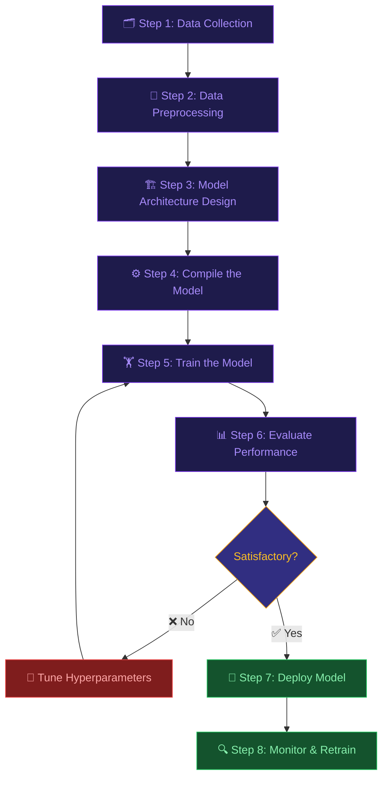

<div align="center">

<!-- Neon Cyberpunk Glitch Banner -->


<br/>

<!-- Matrix rain gif -->


<br/><br/>

<!-- Neon glowing badges -->


<br/><br/>

<!-- Animated snake/activity bar -->


</div>

---

## 🧠 What is Deep Learning?

<div align="center">

</div>

> **Deep Learning** is a subfield of **Machine Learning** and **Artificial Intelligence** that uses multi-layered artificial neural networks to learn representations from data. Inspired by the structure of the human brain, deep learning models can automatically discover features and patterns from raw inputs — such as images, text, or sound — without being explicitly programmed.

The term *"deep"* refers to the **many layers** (depth) of neurons stacked in the network. Each layer learns progressively **higher-level abstractions**:

- 🖼️ **Layer 1** → Edges, colors
- 🔲 **Layer 2** → Shapes, curves
- 🏠 **Layer 3** → Objects, faces
- 💡 **Output Layer** → Final prediction

---

## 🌐 Neural Network Visualization

<div align="center">

```
   INPUT LAYER         HIDDEN LAYERS          OUTPUT LAYER
  ┌─────────┐      ┌────────────────────┐     ┌──────────┐
  │         │      │                    │     │          │
  │  ● x₁   │─────►│  ●  ●  ●  ●  ●   │────►│  ● ŷ    │
  │         │      │                    │     │          │
  │  ● x₂   │─────►│  ●  ●  ●  ●  ●   │────►│  ● ŷ    │
  │         │      │                    │     │          │
  │  ● x₃   │─────►│  ●  ●  ●  ●  ●   │────►│  ● ŷ    │
  │         │      │                    │     │          │
  └─────────┘      └────────────────────┘     └──────────┘
   Features         Learned Abstractions       Predictions
```

</div>

---

## 🚀 Steps in Deep Learning

<div align="center">



</div>

---

### 📌 Step 1 — Data Collection


Collect large volumes of labeled or unlabeled data relevant to your problem.

| Data Type | Examples |
|-----------|----------|
| 🖼️ Images | ImageNet, CIFAR-10, MNIST |
| 📝 Text | Wikipedia, Books, CommonCrawl |
| 🔊 Audio | LibriSpeech, AudioSet |
| 📈 Tabular | UCI Repository, Kaggle datasets |

---

### 📌 Step 2 — Data Preprocessing


Raw data must be cleaned and transformed before training:

- ✅ Handle missing values
- ✅ Normalize / Standardize features
- ✅ One-hot encode categorical labels
- ✅ Augment data (flip, rotate, crop)
- ✅ Split into **Train / Validation / Test** sets

```python
from sklearn.preprocessing import StandardScaler
import numpy as np

X_train = np.load("data/X_train.npy")
scaler = StandardScaler()
X_scaled = scaler.fit_transform(X_train)
```

---

### 📌 Step 3 — Model Architecture Design


Choose and design the neural network structure:

| Architecture | Best For |
|---|---|
| **MLP** (Multi-Layer Perceptron) | Tabular data |
| **CNN** (Convolutional Neural Network) | Images, Vision |
| **RNN / LSTM** | Sequences, Time Series |
| **Transformer** | NLP, Multimodal |
| **GAN** | Image Generation |
| **Autoencoder** | Compression, Anomaly Detection |

```python
import tensorflow as tf

model = tf.keras.Sequential([
    tf.keras.layers.Dense(128, activation='relu', input_shape=(784,)),
    tf.keras.layers.Dropout(0.3),
    tf.keras.layers.Dense(64, activation='relu'),
    tf.keras.layers.Dense(10, activation='softmax')
])
model.summary()
```

---

### 📌 Step 4 — Compile the Model


Set the **optimizer**, **loss function**, and **metrics**:

```python
model.compile(
    optimizer='adam',              # Adaptive Moment Estimation
    loss='categorical_crossentropy',
    metrics=['accuracy']
)
```

| Component | Common Choices |
|---|---|
| **Optimizer** | SGD, Adam, RMSProp, AdaGrad |
| **Loss (Classification)** | Cross-Entropy, Focal Loss |
| **Loss (Regression)** | MSE, MAE, Huber |
| **Metrics** | Accuracy, F1, AUC-ROC |

---

### 📌 Step 5 — Train the Model


Feed data through the network and update weights via **backpropagation**:

```python
history = model.fit(
    X_train, y_train,
    epochs=50,
    batch_size=32,
    validation_split=0.2,
    callbacks=[
        tf.keras.callbacks.EarlyStopping(patience=5),
        tf.keras.callbacks.ModelCheckpoint("best_model.h5")
    ]
)
```

> 🔁 **Backpropagation** computes gradients of the loss with respect to each weight, and the optimizer adjusts weights to minimize the loss.

---

### 📌 Step 6 — Evaluate Performance


Test your model on **unseen data** to measure generalization:

```python
loss, accuracy = model.evaluate(X_test, y_test)
print(f"Test Accuracy: {accuracy * 100:.2f}%")
```

**Common Metrics:**
- 📊 Confusion Matrix
- 📈 Precision, Recall, F1-Score
- 🎯 ROC-AUC Curve

---

### 📌 Step 7 — Hyperparameter Tuning


Optimize model performance by tweaking:

| Hyperparameter | What It Affects |
|---|---|
| Learning Rate | Speed of convergence |
| Batch Size | Memory usage & gradient noise |
| Number of Layers | Model capacity |
| Dropout Rate | Regularization (overfitting control) |
| Activation Function | Non-linearity of the model |

---

### 📌 Step 8 — Deploy & Monitor


Export and serve the model in production:

```python
# Save the model
model.save("deep_learning_model.h5")

# Convert for deployment
converter = tf.lite.TFLiteConverter.from_keras_model(model)
tflite_model = converter.convert()
```

---

## 🗂️ Project Structure

```
📦 deep-learning/
├── 📁 data/              # Raw and processed datasets
├── 📁 notebooks/         # Jupyter notebooks for EDA & experiments
├── 📁 models/            # Saved model files (.h5, .pt)
├── 📁 src/
│   ├── 📄 preprocess.py  # Data preprocessing pipeline
│   ├── 📄 model.py       # Model architecture definitions
│   ├── 📄 train.py       # Training loop & callbacks
│   └── 📄 evaluate.py    # Evaluation & metrics
├── 📁 outputs/           # Plots, logs, and results
├── 📄 requirements.txt
└── 📄 README.md
```

---

## ⚡ Quickstart

```bash
# Clone the repository
git clone https://github.com/yourusername/deep-learning.git
cd deep-learning

# Install dependencies
pip install -r requirements.txt

# Train the model
python src/train.py --epochs 50 --lr 0.001

# Evaluate
python src/evaluate.py --model models/best_model.h5
```

---

## 📚 Resources

| Resource | Link |
|---|---|
| 📖 Deep Learning Book | [deeplearningbook.org](https://www.deeplearningbook.org/) |
| 🎓 Fast.ai Course | [fast.ai](https://www.fast.ai/) |
| 🧪 TensorFlow Docs | [tensorflow.org](https://www.tensorflow.org/) |
| 🔥 PyTorch Docs | [pytorch.org](https://pytorch.org/) |
| 🤗 Hugging Face | [huggingface.co](https://huggingface.co/) |

---

---

<div align="center">

### 🌟 If this project helped you, please consider giving it a star!

[](https://github.com/snow0127/deep-learning)


**Made with ❤️ and lots of 🧠**

</div>
